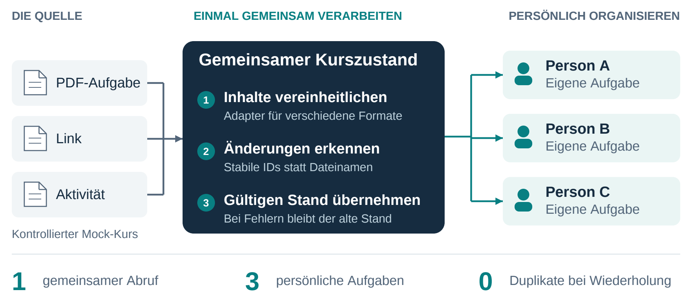
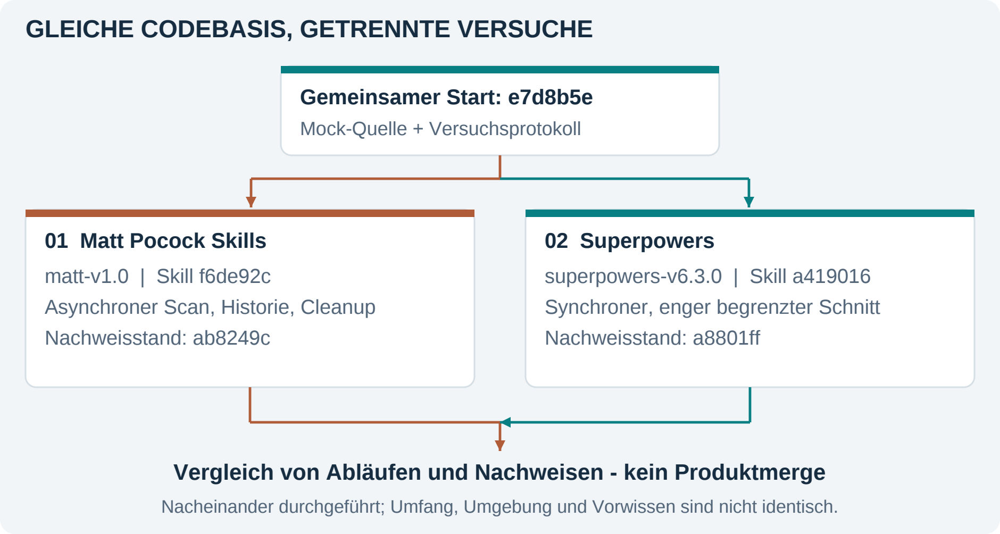
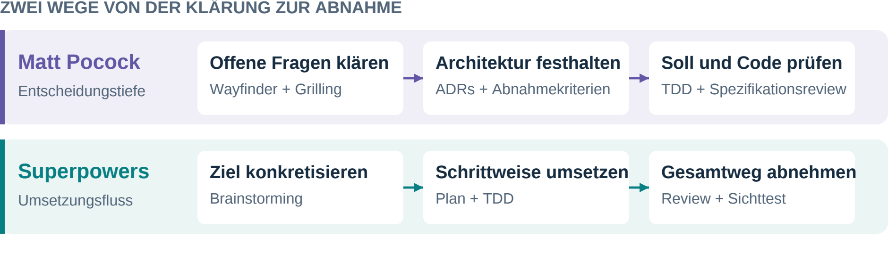
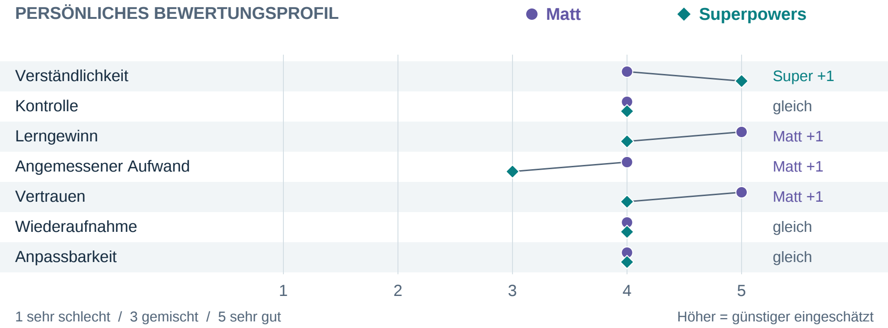

# Von der Feature-Idee zur verlässlichen Software

## Matt Pocock Skills und Superpowers im Praxiseinsatz

**Saburollah Safari | Projektstudie: Study Organizer**

Wie lässt sich KI so in die Softwareentwicklung einbinden, dass nicht nur Code entsteht, sondern ein nachvollziehbares Ergebnis? Am Beispiel einer Moodle-nahen Kursintegration habe ich zwei Entwicklungsworkflows erprobt. Im Mittelpunkt standen Architekturentscheidungen, überprüfbare Anforderungen und die Frage, wie viel Prozess ein Feature tatsächlich braucht.

## 1. Ein Kurs, viele Nutzer - eine robuste Lösung

Studierende sollen einen Kurs verbinden und neue Lernaufgaben in ihrem persönlichen Planer sehen. Dahinter stehen drei Herausforderungen: Inhalte ändern sich, wiederholte Scans dürfen keine Duplikate erzeugen, und gemeinsam genutzte Kursdaten müssen von persönlichen Aufgaben getrennt bleiben.

*Abbildung 1. Architekturprinzip des Mock-Features: einmal abrufen, Änderungen prüfen, berechtigte Nutzer getrennt versorgen. Beispiel mit einem aufgabenfähigen Inhalt und drei Abonnenten.*

Die entscheidende Trennung liegt zwischen **externer Quelle, gemeinsamer Verarbeitung und persönlicher Nutzung**. Ein Adapter vereinheitlicht PDF-, Link- und Aktivitätsinhalte. Stabile Inhalts-IDs ermöglichen den Vergleich mit dem letzten erfolgreichen Stand. Erst ein validierter Scan wird übernommen; bei einem Fehler bleiben vorhandene Daten erhalten.

**Mein Beitrag:** Ich traf und bewertete Produktentscheidungen, prüfte den sichtbaren Benutzerablauf und verglich die Ergebnisse. KI-Agenten unterstützten Architekturarbeit, Implementierung, Tests und Dokumentation. Die Integration wurde bewusst mit einer kontrollierten Mock-Quelle entwickelt; eine reale Moodle-Anbindung war nicht Teil des Versuchs.

<!-- pagebreak -->

## 2. Anforderungen und Versuchsaufbau

Die vollständigen sieben FR und sieben NFR beschreiben den gemeinsamen Vergleichskern. Der Anhang ergänzt Variantenregeln und Prüfbelege; die Matrix fasst die historischen Anforderungen nachträglich zusammen.

**Funktionale Anforderungen - was die Anwendung leisten soll**

| ID | Anforderung | Prüfkriterium |
| --- | --- | --- |
| FR-01 | Unterstützten Mock-Kurs persönlich abonnieren. | Gültiger Link verbindet Kurs und eigenes Modul; unbekannter Link wird abgelehnt. |
| FR-02 | Kurslinks auf eine stabile Identität abbilden. | Alias-Links ergeben denselben Kurs; erneute Anmeldung kein zweites Abo. |
| FR-03 | Gemeinsamen Scan manuell starten. | Ein Abruf liefert bei einem geeigneten Inhalt drei Abonnenten je eine Aufgabe. |
| FR-04 | Neue, geänderte und gleiche Inhalte unterscheiden. | Umbenennung erhält die ID; identischer Scan erzeugt keine zusätzliche Aufgabe. |
| FR-05 | PDF- und Nicht-PDF-Inhalte berücksichtigen. | Fixtures decken verschiedene Arten ab; Dateiendung allein entscheidet nicht. |
| FR-06 | Scanfehler sichtbar und ohne Datenverlust melden. | Timeout oder ungültige Antwort wird gemeldet; letzter gültiger Stand bleibt erhalten. |
| FR-07 | Den vollständigen Ablauf in der Webapp anbieten. | Kurs verbinden, scannen und persönliche Aufgabe mit Quellenbezug öffnen. |

**Nichtfunktionale Anforderungen - welche Qualität dabei gelten muss**

| ID | Qualitätsziel | Prüfkriterium |
| --- | --- | --- |
| NFR-01 | Zugriffsschutz | Ohne passendes eigenes Abo sind Lesen und Scannen nicht erlaubt. |
| NFR-02 | Datenkonsistenz | Änderungen werden vollständig übernommen oder bei Fehlern zurückgerollt. |
| NFR-03 | Wiederholungs- und Parallelitätssicherheit | Höchstens ein Scan je Kurs gleichzeitig; gleiche Wiederholung ohne Duplikate. |
| NFR-04 | Reproduzierbare Tests | Zeit, Quellzustand und Fehler sind ohne echten Moodle-Kurs steuerbar. |
| NFR-05 | Datenschutz | Gemeinsame Daten und Fehlerausgaben enthalten keine persönlichen Zugangsdaten. |
| NFR-06 | Nachvollziehbarkeit | Wichtige Entscheidungen sind mit Regel, Umsetzung und Prüfbeleg verknüpft. |
| NFR-07 | Lokale Ausführbarkeit | Build, Typprüfung, Lint und Tests bestehen; der dokumentierte Start ist bedienbar. |

<!-- pagebreak -->

### Vergleichbare Ausgangsbasis, unterschiedliche Schwerpunkte

*Abbildung 2. Gleicher Start, getrennte Umsetzung. Reihenfolge und Umfang begrenzen die Vergleichbarkeit.*

Festgeschriebene Submodule erlaubten kontrollierte Skill-Updates. Verglichen werden Arbeitsweisen; echte Moodle-Zugänge, Polling und LLM-Erkennung waren ausgeschlossen.

## 3. Was die beiden Arbeitsweisen leisten

### 3.1 Beobachtete Arbeitsweisen

*Abbildung 3. Beobachtete Schwerpunkte: Matt macht offene Entscheidungen sichtbar; Superpowers organisiert die Umsetzung. Beide nutzen Tests und Reviews.*

<!-- pagebreak -->

### 3.2 Persönliche Bewertung mit konkreten Gründen

Ich bewertete beide Abläufe nach denselben sieben Kriterien: **1 = sehr schlecht, 3 = gemischt, 5 = sehr gut**; 2 und 4 sind die Zwischenstufen. Die Punkte beschreiben meine nach Klärung der Kriterien bestätigte Erfahrung, keine objektive Codequalität.

| Kriterium | Matt | Superpowers | Beobachtung hinter den Punkten |
| --- | --- | --- | --- |
| Verständlichkeit | **4** | **5** | Matt machte Entscheidungen nachlesbar; Superpowers führte mich klarer durch den Arbeitsablauf. |
| Kontrolle | **4** | **4** | In beiden Versuchen konnte ich fachliche Entscheidungen und die Ausführung beeinflussen. |
| Lerngewinn | **5** | **4** | Matt vertiefte mein Architekturverständnis; Superpowers verdeutlichte das Zusammenspiel der Anwendungsschichten. |
| Angemessener Aufwand | **4** | **3** | Matts Klärungsaufwand war für mich angemessen; bei Superpowers standen einer hilfreichen Struktur wiederholte kontingentbedingte Wartezeiten gegenüber. |
| Vertrauen | **5** | **4** | Matts gezielte Rückfragen gaben mir zusätzliche Sicherheit; bei Superpowers stärkte der erfolgreiche Praxistest mein Vertrauen. |
| Wiederaufnahme | **4** | **4** | Issues und ADRs beziehungsweise Plan und Logs erleichterten die Fortsetzung. |
| Anpassbarkeit | **4** | **4** | Beide Arbeitsweisen ließen sich an meine Vorgaben anpassen: Matt an die Projektregeln, Superpowers an die gewünschte Ausführungsform. |

Obwohl Matts Ablauf umfangreicher war, empfand ich seinen Aufwand als angemessen, weil die Rückfragen unmittelbar riskante Fachregeln klärten. Bei Superpowers belasteten dagegen wiederholte Wartezeiten den erlebten Aufwand.

*Abbildung 4. Bestätigte persönliche Bewertungen, 1 bis 5; höher ist günstiger. Keine Messung objektiver Softwarequalität.*

**Technische Nachweise:** Matt dokumentiert 225 erfolgreiche Backendtests sowie erfolgreiche Frontendprüfungen. Superpowers dokumentiert 195 Backend- und 97 Frontendtests, Builds, Typprüfung, Lint und die manuelle Sichtabnahme. Die unterschiedlichen Testbestände begründen keinen Qualitätssieger.

<!-- pagebreak -->

## 4. Fazit: Den Prozess am Risiko ausrichten

**Mein Ergebnis ist keine Rangliste, sondern eine belastbare Auswahlregel: Für ein klar begrenztes Produktinkrement würde ich mit Superpowers beginnen. Sobald Fehler an Datenidentität, Berechtigungen oder Lebenszyklus schwer rückgängig zu machen sind, würde ich gezielt Matts stärkere Architekturklärung und Spezifikationsprüfung ergänzen.**

Die persönliche Bewertung stützt diese Entscheidung: Matt liegt bei Lerngewinn, angemessenem Aufwand und Vertrauen vorn; Superpowers bei Verständlichkeit. Kontrolle, Wiederaufnahme und Anpassbarkeit bewerte ich gleich. Entscheidend ist daher nicht, welche Suite allgemein „besser“ ist, sondern welcher Prozess das konkrete Projektrisiko am wirksamsten reduziert.

### 4.1 Matt: Entscheidungstiefe mit höherem Prozessgewicht

**Stärke.** Wayfinder, Grilling und ADRs machten fachliche Abhängigkeiten früh sichtbar. Das war bei stabiler Kursidentität und persönlichen Aufgaben besonders wertvoll: Eine falsche Regel hätte Duplikate erzeugen oder Benutzerdaten falsch zuordnen können. Die Akzeptanzmatrix verband Entscheidungen mit prüfbaren Kriterien. Der spätere Spezifikationsreview fand tatsächlich fehlende Cleanup-Regeln, obwohl das Haupt-Issue bereits geschlossen war. Damit zeigte der Ansatz einen konkreten Qualitätsnutzen über grüne Tests hinaus.

**Risiko.** Die vielen Klärungs- und Dokumentationsschritte vergrößerten den Prozess und passen nicht automatisch zu jeder kleinen Änderung. Entscheidungstiefe kann in Überplanung kippen, wenn risikoarme Fragen genauso ausführlich behandelt werden wie irreversible Architekturentscheidungen. Matt ist deshalb für mich besonders stark, wenn mehrere Schichten betroffen sind oder Datenregeln langfristig tragen müssen - nicht als pauschales Pflichtprogramm für jedes Feature.

### 4.2 Superpowers: Umsetzungsfluss im engeren Versuchsrahmen

**Stärke.** Brainstorming, bestätigtes Design, Plan und TDD führten klar von der Idee zum ausführbaren vertikalen Schnitt. Der zusammenhängende Weg von der Kursregistrierung bis zur sichtbaren persönlichen Aufgabe war leicht nachzuvollziehen und praktisch abnehmbar. Für einen klar definierten Umfang bietet Superpowers daher einen überzeugenden Standardprozess: kleine Schritte, unmittelbare Tests und ein sichtbares Ergebnis.

**Grenze des Versuchs.** Die gute Struktur garantiert weder geringe Kosten noch vollständige fachliche Abdeckung. Kontingentbedingte Wartezeiten bremsten die Ausführung; beim Wechsel auf Inline-Arbeit entfiel zudem eine unabhängige Reviewperspektive. Der Versuch umfasste bewusst keinen vollständigen Cleanup- und Reaktivierungslebenszyklus. Deshalb belegt das Ergebnis die Eignung für diesen engeren Schnitt, aber nicht, dass derselbe Ablauf Matts größeren und risikoreicheren Umfang schneller oder vollständiger geliefert hätte.

<!-- pagebreak -->

### 4.3 Was der Vergleich über Qualität zeigt

Grüne Tests allein genügten in keinem Versuch. Bei Matt fehlte zunächst vereinbartes Lebenszyklusverhalten; bei Superpowers scheiterte der lokale Start zunächst an Konfigurationsproblemen. Erst der Review gegen die Anforderungen beziehungsweise der reale Benutzerablauf machte diese Lücken sichtbar. Mein wichtigster Qualitätsmaßstab ist deshalb eine Nachweiskette aus **Regeltest, Spezifikationsreview und sichtbarer End-to-End-Abnahme**. Ein Feature ist erst abgeschlossen, wenn diese Nachweise zusammenpassen.

### 4.4 Mein Verbesserungsvorschlag für künftige Projekte

Ich würde beide Arbeitsweisen nicht vollständig mischen, sondern abhängig vom Risiko kombinieren:

1. **Früh einen lauffähigen Weg herstellen.** Backend, Datenbank und Frontend werden verbunden, bevor der Umfang wächst. So fallen Konfigurations- und Migrationsprobleme früh auf.
2. **Architekturklärung nach Risiko vertiefen.** Bei Identität, Berechtigungen, Nebenläufigkeit oder schwer änderbaren Regeln ergänze ich Grilling, ADR und Akzeptanzkriterien; bei risikoarmen Änderungen genügt ein kompakter Entwurf.
3. **In überprüfbaren Schritten liefern.** Plan und TDD verbinden jeden Schritt mit einem fachlichen Ergebnis und Testbeleg.
4. **Abschluss an Nachweise binden.** Ohne Test, Reviewbeleg oder Sichttest bleibt eine Anforderung offen - auch wenn der Agent „fertig“ meldet.

Dieser risikobasierte Prozess ist mein Verbesserungsvorschlag. Er folgt aus beiden Versuchen, wurde aber noch nicht separat evaluiert.

### 4.5 Reichweite der Empfehlung

Der Vergleich ist praxisnah, aber kein kontrolliertes Benchmark. Matts Umfang war breiter; Superpowers wurde später und mit mehr Domänenwissen eingesetzt. Tokenlimits begrenzten unabhängige Reviews, eine Mock-Quelle ersetzte Moodle. Die Empfehlung gilt deshalb für diesen Projektkontext. Ein Folgeversuch sollte Umfang und Ausgangsinformationen angleichen sowie Zeit- und Tokenkosten messen.

## 5. Was ich persönlich mitnehme

Fachlich kann ich nun begründen, warum Kurs, externer Inhalt und persönliche Aufgabe getrennte Identitäten und Lebenszyklen brauchen. Methodisch lernte ich, KI-Vorschläge nicht mit Produktentscheidungen gleichzusetzen: Annahmen, Risiken und Folgen muss ich selbst bewerten.

Mein größter Lernschritt war der Wechsel vom „Code erzeugen lassen“ zum **gezielten Steuern, Begründen und Prüfen**. Ich schärfte Anforderungen, bestätigte Architekturentscheidungen und nahm das Ergebnis im Browser ab. Agenten verbesserten Tempo und Struktur; die Verantwortung für Umfang, Qualität und Freigabe blieb bei mir.

## Nachweise

Die Aussagen stützen sich auf das [Versuchsprotokoll](experiment-protocol.md), die Beobachtungslogs beider Versuche und dokumentierte Test- und Reviewstände. [Methodik, Variantenregeln und Quellen](PAPER-ANHANG.md) liegen getrennt im Quellenpaket. Dort bleiben auch Versionsstände und die ausführliche Bewertungsgrundlage zugänglich.
