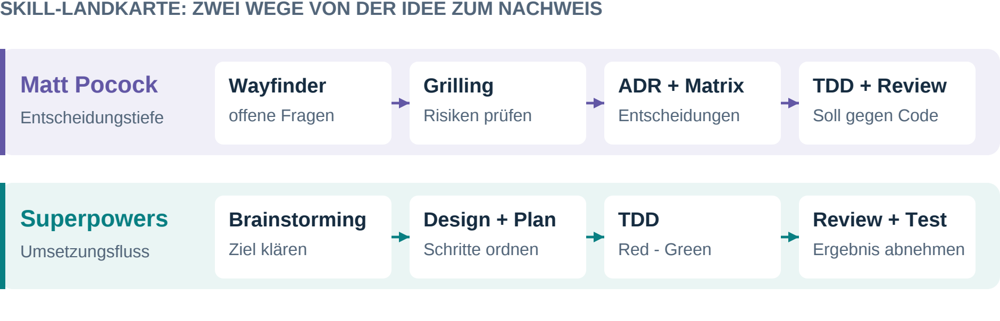
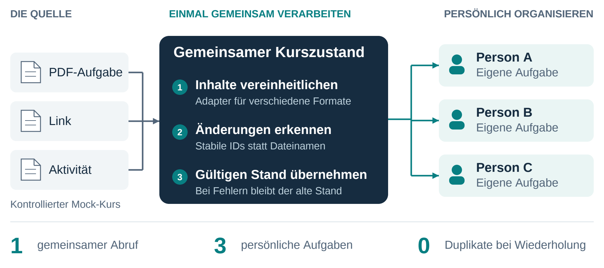
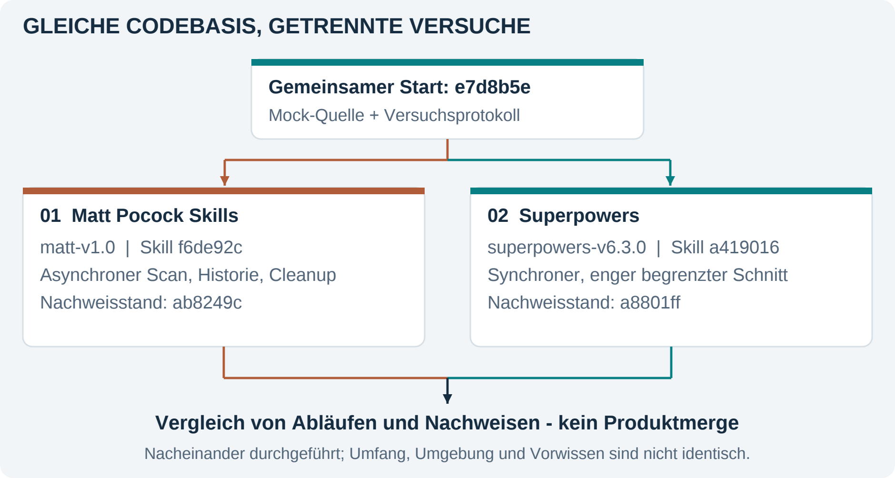
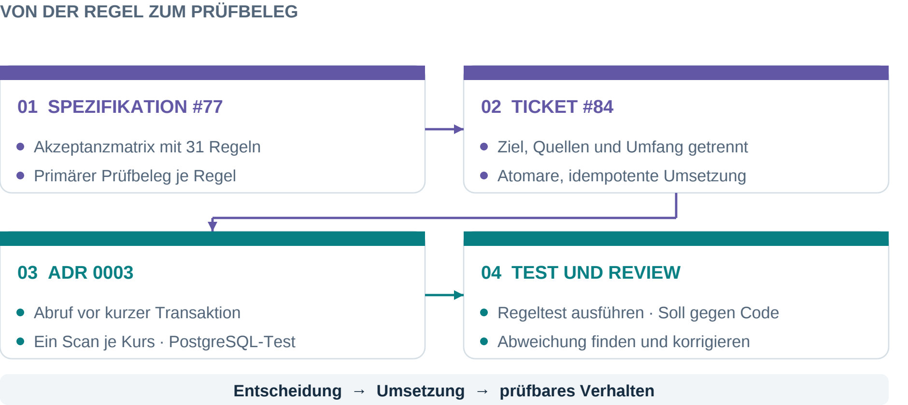
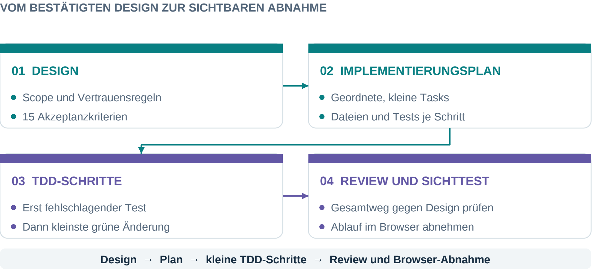
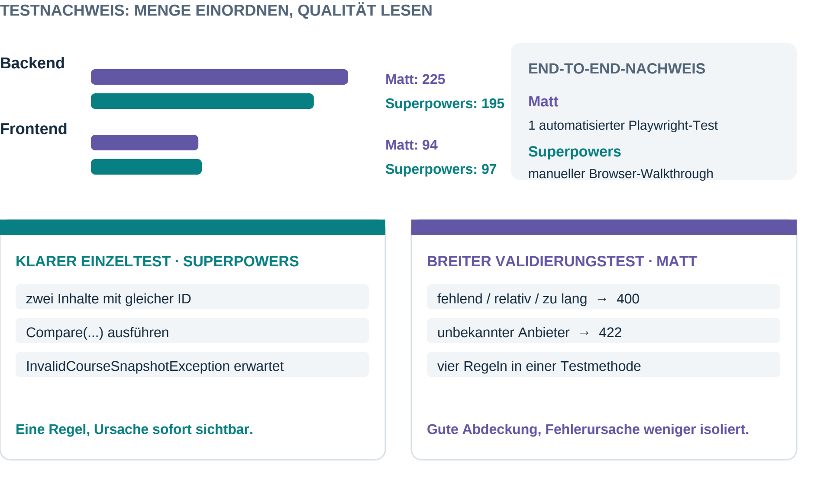
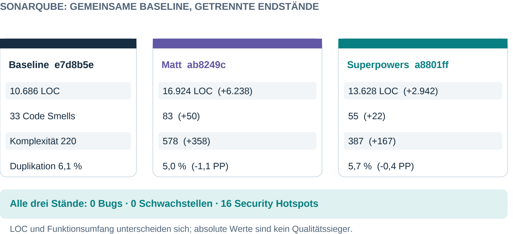
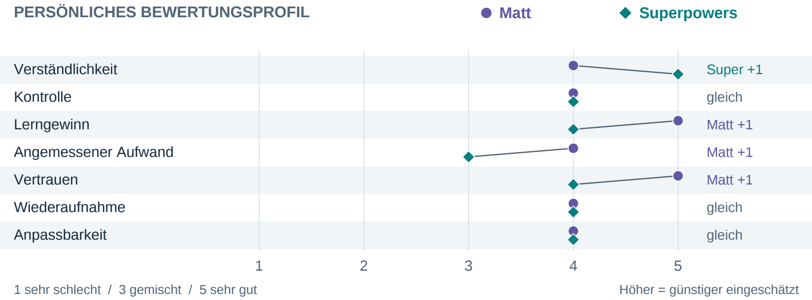
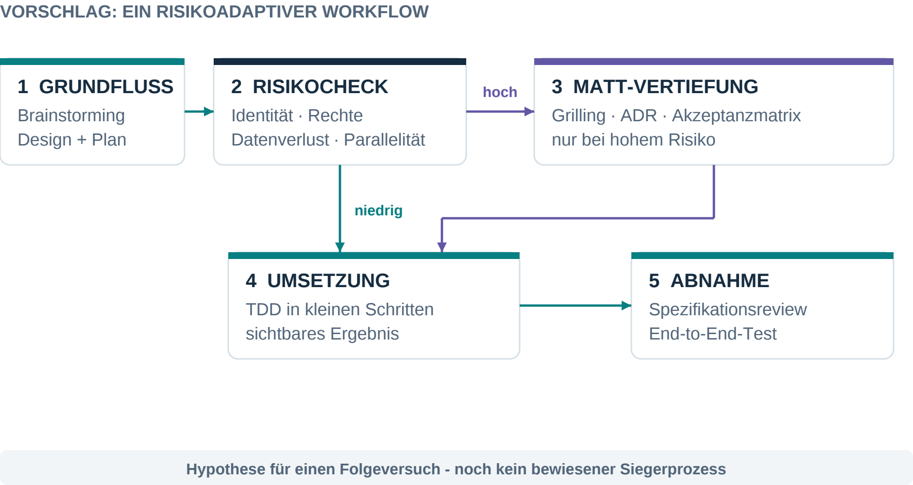

# Von der Feature-Idee zur verlässlichen Software

## Matt Pocock Skills und Superpowers im Praxiseinsatz

**Saburollah Safari | Projektstudie: Study Organizer**

Wie lässt sich KI so in die Softwareentwicklung einbinden, dass nicht nur Code entsteht, sondern ein nachvollziehbares Ergebnis? Am Beispiel einer Moodle-nahen Kursintegration habe ich zwei Skill-Suites erprobt. Im Mittelpunkt standen Architekturentscheidungen, überprüfbare Anforderungen und die Frage, wie viel Prozess ein Feature tatsächlich braucht.

*Abbildung 1. Matt vertieft offene Entscheidungen und ihre Nachweise; Superpowers strukturiert den Weg von der Idee zum ausführbaren Inkrement. Die Darstellung zeigt beobachtete Schwerpunkte, keine exklusiven Fähigkeiten.*

**Kurzfazit:** Für ein klar begrenztes Inkrement würde ich mit Superpowers beginnen. Bei schwer rückgängig zu machenden Risiken ergänze ich gezielt Matts Grilling, ADRs und Akzeptanzmatrix. Beide Wege benötigen neben grünen Tests eine Prüfung von Spezifikation, Code und sichtbarem Ablauf.

<!-- pagebreak -->

## 1. Ein Kurs, viele Nutzer - eine robuste Lösung

Studierende sollen einen Kurs verbinden und neue Lernaufgaben in ihrem persönlichen Planer sehen. Dahinter stehen drei Herausforderungen: Inhalte ändern sich, wiederholte Scans dürfen keine Duplikate erzeugen, und gemeinsam genutzte Kursdaten müssen von persönlichen Aufgaben getrennt bleiben.

*Abbildung 2. Architekturprinzip des Mock-Features: einmal abrufen, Änderungen prüfen, berechtigte Nutzer getrennt versorgen. Beispiel mit einem aufgabenfähigen Inhalt und drei Abonnenten.*

Die entscheidende Trennung liegt zwischen **externer Quelle, gemeinsamer Verarbeitung und persönlicher Nutzung**. Ein Adapter vereinheitlicht PDF-, Link- und Aktivitätsinhalte. Stabile Inhalts-IDs ermöglichen den Vergleich mit dem letzten erfolgreichen Stand. Erst ein validierter Scan wird übernommen; bei einem Fehler bleiben vorhandene Daten erhalten.

**Mein Beitrag:** Ich traf und bewertete Produktentscheidungen, las Spezifikationen und Tests, prüfte den sichtbaren Benutzerablauf und verglich die Ergebnisse. KI-Agenten unterstützten Architekturarbeit, Implementierung, Tests und Dokumentation. Die Integration wurde bewusst mit einer kontrollierten Mock-Quelle entwickelt; eine reale Moodle-Anbindung war nicht Teil des Versuchs.

<!-- pagebreak -->

## 2. Anforderungen und Versuchsaufbau

Die sieben FR und sieben NFR beschreiben den gemeinsamen Vergleichskern. Der Anhang ergänzt Variantenregeln und Prüfbelege; die Matrix rekonstruiert die historischen Anforderungen und ist kein nachträglich ausgeführter Abnahmetest.

**Funktionale Anforderungen - was die Anwendung leisten soll**

| ID | Anforderung | Prüfkriterium |
| --- | --- | --- |
| FR-01 | Unterstützten Mock-Kurs persönlich abonnieren. | Gültiger Link verbindet Kurs und eigenes Modul; unbekannter Link wird abgelehnt. |
| FR-02 | Kurslinks auf eine stabile Identität abbilden. | Alias-Links ergeben denselben Kurs; erneute Anmeldung kein zweites Abo. |
| FR-03 | Gemeinsamen Scan manuell starten. | Ein Abruf liefert bei einem geeigneten Inhalt drei Abonnenten je eine Aufgabe. |
| FR-04 | Neue, geänderte und gleiche Inhalte unterscheiden. | Umbenennung erhält die ID; identischer Scan erzeugt keine zusätzliche Aufgabe. |
| FR-05 | PDF- und Nicht-PDF-Inhalte berücksichtigen. | Fixtures decken verschiedene Arten ab; Dateiendung allein entscheidet nicht. |
| FR-06 | Scanfehler sichtbar und ohne Datenverlust melden. | Timeout oder ungültige Antwort wird gemeldet; letzter gültiger Stand bleibt erhalten. |
| FR-07 | Den vollständigen Ablauf in der Webapp anbieten. | Kurs verbinden, scannen und persönliche Aufgabe mit Quellenbezug öffnen. |

**Nichtfunktionale Anforderungen - welche Qualität dabei gelten muss**

| ID | Qualitätsziel | Prüfkriterium |
| --- | --- | --- |
| NFR-01 | Zugriffsschutz | Ohne passendes eigenes Abo sind Lesen und Scannen nicht erlaubt. |
| NFR-02 | Datenkonsistenz | Änderungen werden vollständig übernommen oder bei Fehlern zurückgerollt. |
| NFR-03 | Wiederholungs- und Parallelitätssicherheit | Höchstens ein Scan je Kurs gleichzeitig; gleiche Wiederholung ohne Duplikate. |
| NFR-04 | Reproduzierbare Tests | Zeit, Quellzustand und Fehler sind ohne echten Moodle-Kurs steuerbar. |
| NFR-05 | Datenschutz | Gemeinsame Daten und Fehlerausgaben enthalten keine persönlichen Zugangsdaten. |
| NFR-06 | Nachvollziehbarkeit | Wichtige Entscheidungen sind mit Regel, Umsetzung und Prüfbeleg verknüpft. |
| NFR-07 | Lokale Ausführbarkeit | Build, Typprüfung, Lint und Tests bestehen; der dokumentierte Start ist bedienbar. |

<!-- pagebreak -->

### Vergleichbare Ausgangsbasis, unterschiedliche Schwerpunkte

*Abbildung 3. Gleicher Start, getrennte Umsetzung. Reihenfolge, Vorwissen und Umfang begrenzen die direkte Vergleichbarkeit.*

Festgeschriebene Submodule erlaubten kontrollierte Skill-Updates. Echte Moodle-Zugänge, Polling und LLM-Erkennung waren ausgeschlossen.

### Git-Fakten zu den festgeschriebenen Vergleichsständen

| Git-Messwert | Matt | Superpowers |
| --- | --- | --- |
| Commits ohne Merge-Commits | 32 | 28 |
| Geänderte Dateien insgesamt | 139 | 92 |
| Handgeschriebener Produktcode, hinzugefügt / entfernt | +6.555 / -121 Zeilen | +3.240 / -70 Zeilen |
| Branching-Strategie | Mehrere Feature-Branches und PRs | Ein isolierter Experiment-Branch |

Die Werte beschreiben den Umfang, nicht die Qualität. Matt bearbeitete einen breiteren Lebenszyklus. Messbasis: gemeinsamer Start `e7d8b5e`, Matt `ab8249c`, Superpowers `a8801ff`; Zählregeln stehen in den Nachweisen.

<!-- pagebreak -->

## 3. Was die beiden Arbeitsweisen leisten

### 3.1 Matt-Artefakte: Entscheidungen werden prüfbar

*Abbildung 4. Drei persönlich geprüfte Ausschnitte zeigen, was Leser von der Suite erwarten können: Issue #77 strukturiert Regeln und Nachweise, Issue #84 verbindet Ziel und Quellen, ADR 0003 hält die Transaktions- und Parallelitätsentscheidung fest.*

Die Akzeptanzmatrix in **Issue #77** macht fachliche Regeln und den erforderlichen Nachweis transparent. Drei Beispiele sind Registrierung mit API-Prüfung, unterstützte Inhaltstypen mit Domänen- und PostgreSQL-Nachweis sowie Idempotenz mit Domänen- und PostgreSQL-Test. Das unterstützt TDD, ist mit 31 Matrixzeilen für einen Mock-Versuch aber umfangreich.

**Issue #84** trennt Ziel, Quellen und Umfang. Das Ticket verweist auf Wayfinder-, Scan-, Datenmodell- und Akzeptanzentscheidungen sowie zwei ADRs. **ADR 0003** begründet den Abruf außerhalb der Datenbanktransaktion, kurze atomare Speicherung, einen aktiven Scan pro Kurs und reale PostgreSQL-Tests. Diese Kette verbessert Rückverfolgbarkeit, kostet jedoch Vorbereitung und Pflege.

<!-- pagebreak -->

### 3.2 Superpowers-Artefakte: Umsetzung wird schrittweise prüfbar

*Abbildung 5. Superpowers hält zuerst Design und Akzeptanzkriterien fest, zerlegt sie danach in kleine Implementierungsschritte und führt diese mit TDD bis zum Abschlussreview und Browser-Walkthrough aus.*

Das bestätigte **Design** grenzt den Mock-Umfang ab und hält Vertrauensregeln sowie 15 Akzeptanzkriterien fest. Der **Implementierungsplan** ordnet die Arbeit in kleine Tasks und benennt pro Schritt betroffene Dateien und Tests. Dadurch bleibt vor der Umsetzung sichtbar, welches Verhalten als Nächstes entstehen soll.

TDD-Commits und Aktivitätslog dokumentieren anschließend den schrittweisen Weg von fehlschlagenden Tests zur kleinsten grünen Änderung. Abschlussreview und Browser-Walkthrough prüfen den vollständigen Benutzerablauf. Diese Kette ist kompakter und linearer als Matts Issue- und ADR-Struktur, dokumentiert Architekturentscheidungen aber weniger tief.

<!-- pagebreak -->

### 3.3 Tests: Anzahl ist nicht gleich Qualität

*Abbildung 6. Abschlussstände: Matt 225 Backend- und 94 Frontendtests; Superpowers 195 Backend- und 97 Frontendtests. Die Funktionsumfänge unterscheiden sich. Laufzeiten werden deshalb nicht als Leistungsvergleich verwendet.*

Ich habe nicht nur grüne Summen übernommen, sondern ausgewählte Tests gelesen. Der Superpowers-Test `Compare_DuplicateIncomingIds_ThrowsInvalidSnapshot` besitzt einen engen Arrange-Act-Assert-Aufbau: zwei gleiche externe IDs führen genau zu einer erwarteten Fachausnahme. Ursache und Regel sind sofort erkennbar.

Matts `Register_ValidatesCourseUrl` deckt fehlende, relative, überlange und nicht unterstützte URLs ab. Die fachliche Abdeckung ist gut, aber mehrere unterschiedliche Regeln stehen in einer Methode. Getrennte oder parametrisierte Fälle würden Fehlerursachen schneller sichtbar machen. Bei Parallelität liefert Matt dagegen den stärkeren PostgreSQL-Belastungsnachweis; Superpowers formuliert das erwartete Verhalten kompakter. **Mein Urteil:** Testanzahl zeigt Aktivität, Testqualität zeigt Verständlichkeit, fachliche Aussage und realistische Infrastruktur.

<!-- pagebreak -->

### 3.4 Statische Codeprüfung mit SonarQube

*Abbildung 7. SonarQube Community 25.6 und .NET Scanner 11.3, identische Ausschlüsse und dieselbe Baseline. Deltas sind aussagekräftiger als absolute Werte, weil Matt mehr Produktumfang enthält.*

SonarQube meldete in allen drei Ständen **0 Bugs und 0 Schwachstellen**. Die 16 Security Hotspots blieben unverändert; sie sind Prüfpunkte, keine nachgewiesenen Sicherheitsfehler. Eine Coverage-Angabe wurde nicht bewertet, weil keine Coverage-Reports importiert wurden. Auch das bestandene Standard-Quality-Gate ist kein Beweis für Fehlerfreiheit.

Der wichtigste Wartbarkeitsbefund lag in der Scanverarbeitung. Bei Matt erreicht `CourseScanOrchestrator.ScanAsync` eine kognitive Komplexität von **64 statt 15** und bündelt Validierung, Parallelität, Abruf, Transaktion und persönliche Auswirkungen. Superpowers trennt den Ablauf stärker, doch `PersistSuccessfulScanAsync` erreicht noch **36 statt 15**. Beide Befunde sind berechtigt; Matt deckt zugleich einen breiteren Lebenszyklus ab.

Eine ergänzende manuelle Codeprüfung bestätigte drei sichtbare Lücken:

| Variante | Bestätigte Lücke | Verbesserung |
| --- | --- | --- |
| Matt | Aufgabenkarte zeigt vorhandene externe Herkunft nicht. | Quelle und Link anzeigen. |
| Superpowers | Scanstatus kann nach dem Scan veraltet bleiben. | Kartenstatus aktualisieren. |
| Superpowers | Backend-Prüfgründe passen nicht zu den Übersetzungsschlüsseln. | Verträge vereinheitlichen und testen. |

<!-- pagebreak -->

### 3.5 Persönliche Bewertung mit konkreten Gründen

Skala: **5 = sehr gut ohne relevante Einschränkung, 4 = sehr gut mit konkreter Einschränkung, 3 = gemischt, 2 = eher schlecht, 1 = sehr schlecht.** Die Punkte beschreiben meine Erfahrung, keine objektive Codequalität.

| Kriterium | Matt | Superpowers | Beobachtung hinter den Punkten |
| --- | --- | --- | --- |
| Verständlichkeit | **4** | **5** | Matt war nachlesbar, aber durch viele Fragen und Issues weniger kompakt; Superpowers führte geschlossen durch den Ablauf. |
| Kontrolle | **4** | **4** | Beide ließen zentrale Entscheidungen zu; bei Matt waren sie stärker verteilt, bei Superpowers korrigierte ich die Branch-Trennung. |
| Lerngewinn | **5** | **4** | Matt vertiefte Architektur und Lebenszyklus; Superpowers erklärte die Anwendungsschichten gut, aber weniger tief. |
| Angemessener Aufwand | **4** | **3** | Matts Rückfragen waren hilfreich, aber zahlreich; Superpowers wurde durch Kontingentpausen unterbrochen. |
| Vertrauen | **5** | **4** | Matt deckte Risiken früh auf; Superpowers bestand den Praxistest, hatte aber anfängliche Startprobleme. |
| Wiederaufnahme | **4** | **4** | Dokumente und Logs halfen bei beiden; ihre Menge erforderte dennoch Orientierung. |
| Anpassbarkeit | **4** | **4** | Beide ließen sich anpassen; Matt blieb prozessintensiv, Superpowers erforderte manuelle Korrekturen. |

*Abbildung 8. Bestätigte persönliche Bewertungen von 1 bis 5; höher ist günstiger. Keine Messung objektiver Softwarequalität.*

<!-- pagebreak -->

## 4. Fazit: Den Prozess am Risiko ausrichten

**Mein Ergebnis ist keine Rangliste:** Für ein klar begrenztes Produktinkrement würde ich mit Superpowers beginnen. Sobald Fehler an Datenidentität, Berechtigungen, Parallelität oder Lebenszyklus schwer rückgängig zu machen sind, würde ich Matts vertiefte Architekturklärung und Spezifikationsprüfung ergänzen.

### 4.1 Was Matt besonders gut leistet

Wayfinder, Grilling, ADRs und Akzeptanzmatrix machten fachliche Abhängigkeiten früh sichtbar. Der spätere Spezifikationsreview fand fehlende Cleanup-Regeln, obwohl das Haupt-Issue bereits geschlossen war. Der Qualitätsnutzen geht damit über grüne Tests hinaus. Das Risiko ist Überplanung: Nicht jede kleine Änderung benötigt dieselbe Tiefe wie eine irreversible Datenentscheidung.

### 4.2 Was Superpowers besonders gut leistet

Brainstorming, bestätigtes Design, Plan und TDD führten klar von der Idee zum ausführbaren vertikalen Schnitt. Der Weg von der Kursregistrierung bis zur persönlichen Aufgabe war gut nachvollziehbar. Der Versuch umfasste jedoch keinen vollständigen Cleanup- und Reaktivierungslebenszyklus; außerdem zeigte erst der reale Start Konfigurationsprobleme.

### 4.3 Vorschlag für einen kombinierten Workflow

*Abbildung 9. Superpowers strukturiert den Grundfluss. Ein kurzer Risikocheck entscheidet, ob Grilling, ADR und Akzeptanzmatrix ergänzt werden. Tests, unabhängiger Spezifikationsreview und sichtbare End-to-End-Abnahme schließen beide Wege ab.*

<!-- pagebreak -->

### 4.4 Was der Vergleich über Qualität zeigt

Grüne Tests allein genügten in keinem Versuch. Mein wichtigster Qualitätsmaßstab ist eine Nachweiskette aus **Regeltest, Spezifikationsreview, statischer Analyse und sichtbarer End-to-End-Abnahme**. SonarQube ergänzt diese Kette um reproduzierbare Wartbarkeitsbefunde, ersetzt aber weder fachliche Tests noch menschliche Freigabe.

### 4.5 Ausblick: Die Kombination kontrolliert prüfen

Der kombinierte Workflow ist eine begründete Hypothese, noch kein bewiesenes Ergebnis. Ein Folgeversuch sollte dieselbe Aufgabe unter drei Bedingungen durchführen: nur Matt, nur Superpowers und die Kombination. Verglichen werden Bearbeitungszeit, Tokenverbrauch, Rückfragen, Korrekturschleifen, gefundene Fehler und persönliche Bewertung. Umfang, Ausgangsinformationen und Nachweise müssen dabei identisch sein.

## 5. Was ich persönlich mitnehme

- **Risiken zuerst benennen.** Identität, Rechte, Datenverlust und Nebenläufigkeit entscheiden, wie viel Spezifikation nötig ist.
- **Tests lesen, nicht nur zählen.** Ein guter Test macht eine Fachregel und ihre Fehlerursache unmittelbar verständlich.
- **Ergebnisse dreifach prüfen.** Regeltest, Soll-Ist-Review und sichtbarer Ablauf decken unterschiedliche Fehlerklassen ab.

Mein größter Lernschritt war der Wechsel vom „Code erzeugen lassen“ zum **gezielten Steuern, Begründen und Prüfen**. Agenten verbesserten Tempo und Struktur; die Verantwortung für Umfang, Qualität und Freigabe blieb bei mir.

## Nachweise

Die Aussagen stützen sich auf das [Versuchsprotokoll](experiment-protocol.md), die Beobachtungslogs, die persönlich geprüften Matt-Artefakte, dokumentierte Testläufe und die SonarQube-Baselineanalyse. [Methodik, Variantenregeln und Quellen](PAPER-ANHANG.md) liegen getrennt im Quellenpaket.
